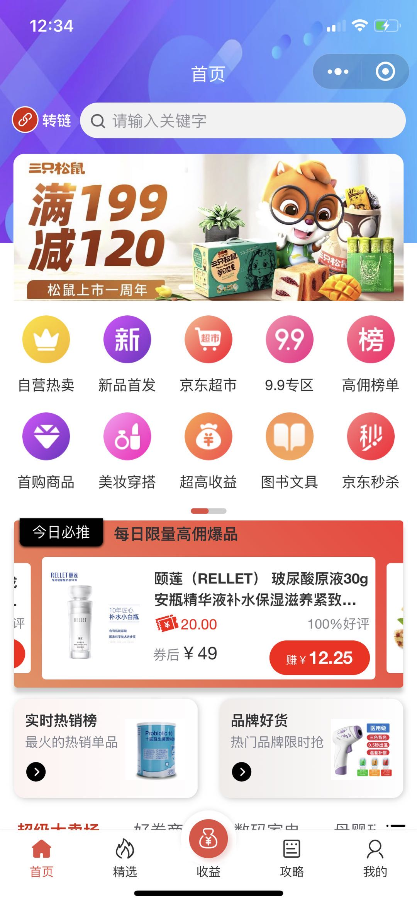
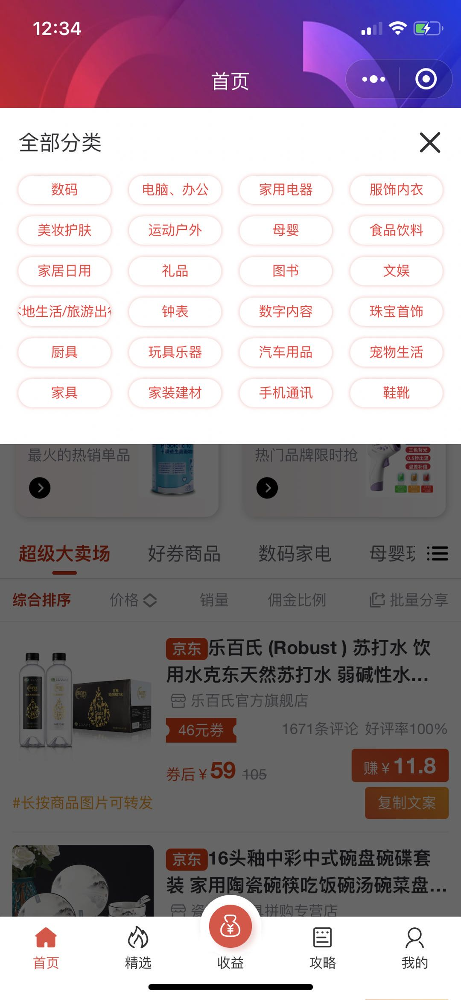
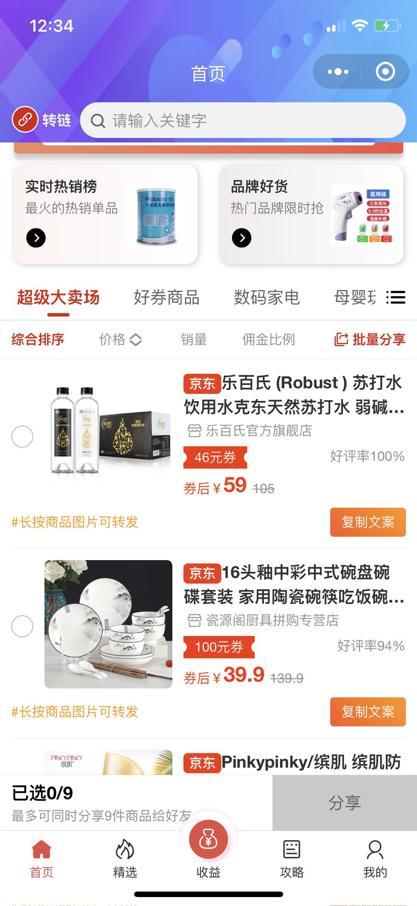
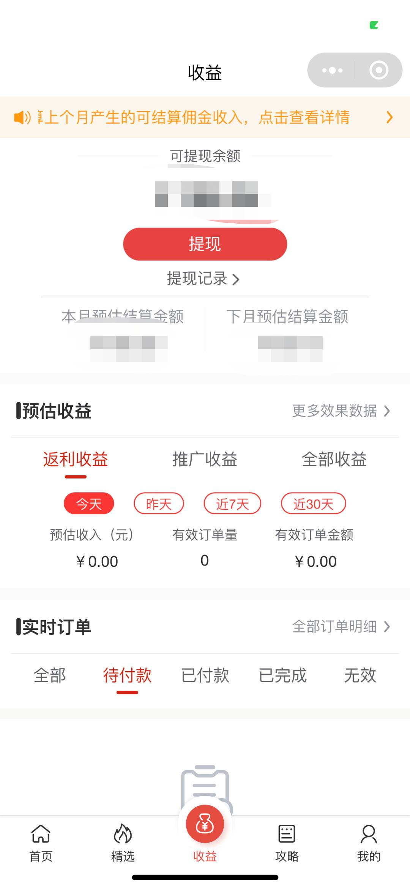
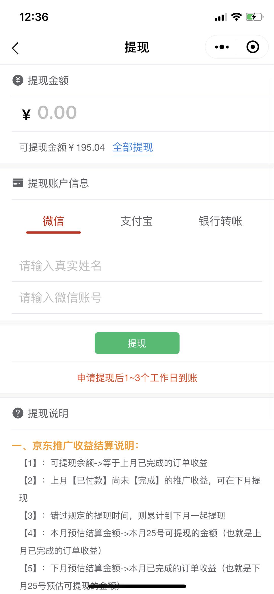
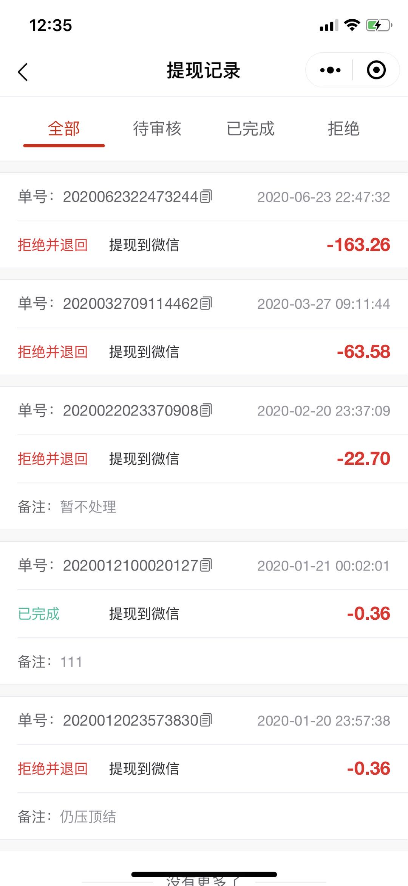
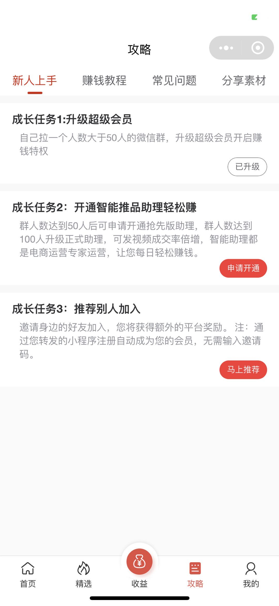
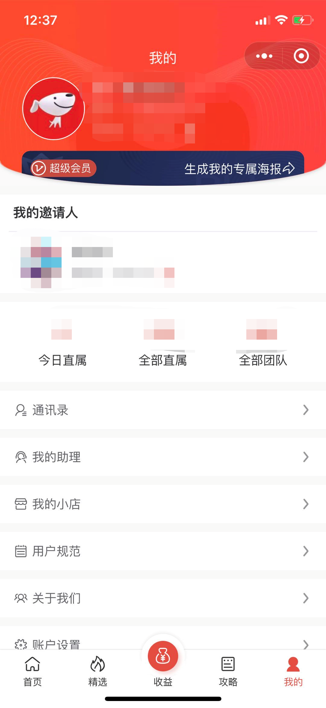

wo621171: 用 uni-app 开发多端一键发布的返利小程序

在 【京东联盟API】 基础上，扩展无法发展团队的弱势，并进行丰富的功能扩展!

点击链接加入群聊【返利小程序技术交流群】

# 首页(参考京粉设计)
##### 主界面

##### 分类

##### 批量分享

# 收益(参考京粉设计)

##### 申请提现

##### 提现记录

# 任务(参考芬香设计)

# 我的

